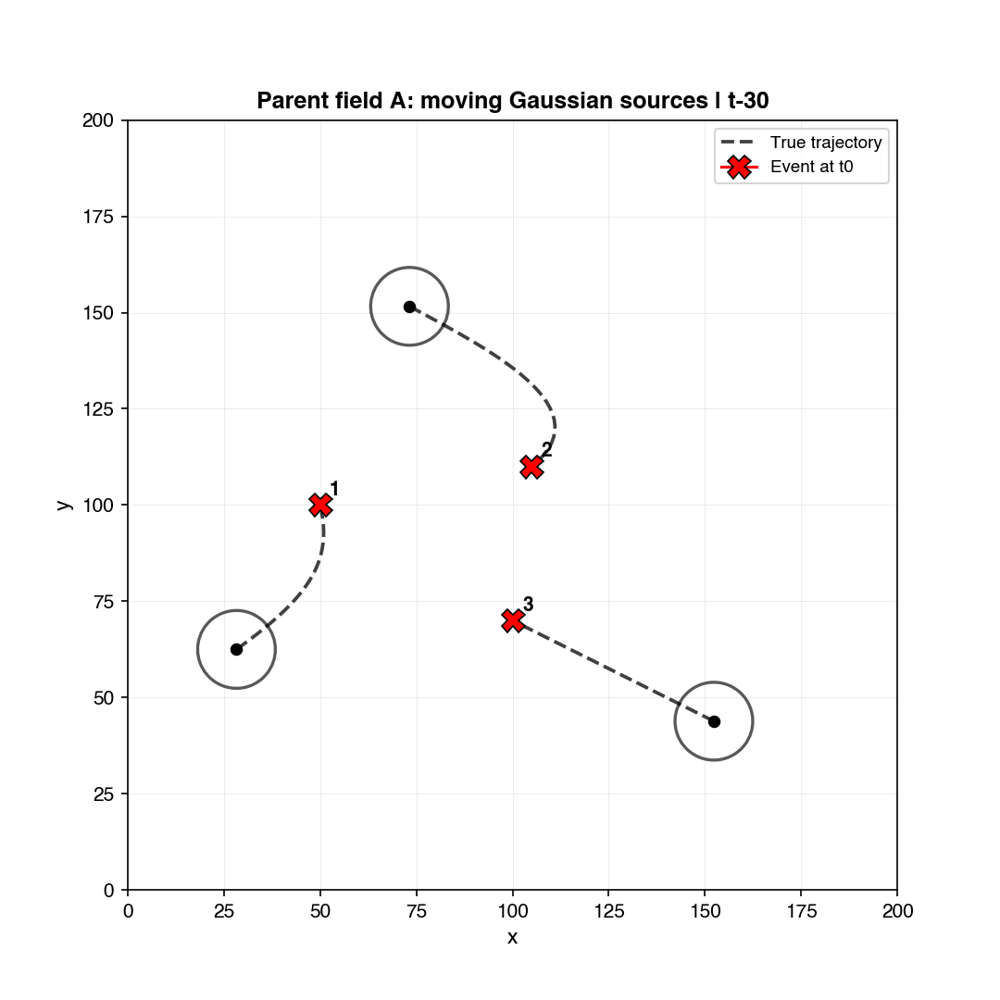
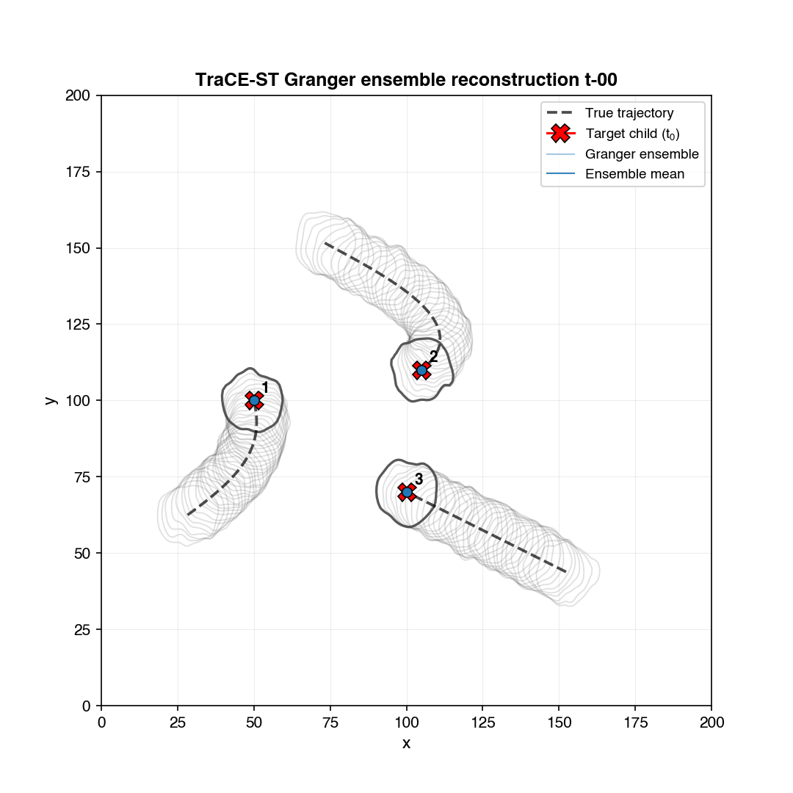

# TraCE-ST: tracing the space-time causal origins of Earth system extremes

TraCE-ST (**Tracer of Causal Evolutions in Space and Time**) reconstructs event-conditioned causal pathways in multivariate gridded data. Starting from an event at a chosen variable, location, and time, it works backward through a sequence of locally inferred causal graphs to identify where influential signals came from, which variables carried them, and how those influences evolved before the event.

The framework is Lagrangian-inspired, but it does **not** trace physical parcels through a velocity field. Instead, it traces inferred causal influence: at every backward step, TraCE-ST estimates lagged dependencies in a moving space–time window, groups causal parents with coherent directions, selects a parent group, and moves the analysis region toward that group's inferred origin.

This repository contains the Python implementation, introductory synthetic and real-data tutorials, and the analysis workflows accompanying the manuscript:

> J. S. Pérez-Carrasquilla et al., *Tracing the space-time causal origins of Earth system extremes* (manuscript in preparation).

## Why TraCE-ST?

Extreme Earth system events commonly emerge from interacting processes distributed across variables, locations, and times. Conventional causal-discovery graphs can identify local dependencies, but a local edge alone does not explain the realized, multi-step pathway leading to a particular event. TraCE-ST turns successive local causal estimates into an event-centered trajectory.

Given a target event, TraCE-ST:

1. encodes a local space–time stencil using **M-CaStLe** (multivariate Causal Space-Time Stencil Learning);
2. estimates directed, one-lag parent–child relationships with a selected causal-discovery engine;
3. groups parents by variable, relationship sign, and spatial direction;
4. selects a parent group deterministically or probabilistically;
5. shifts the analysis region backward in space and time and repeats; and
6. aggregates repeated probabilistic tracks into variable-specific trajectory densities.

The resulting trajectory is an ordered sequence of `(variable, spatial region)` pairs. With one parameter configuration held fixed, a probabilistic Monte Carlo ensemble repeatedly samples among competing parent groups according to their inferred causal strengths. The resulting spread represents pathway-selection uncertainty under that configured model—not sensitivity to the parameter values. Locations and variables repeatedly visited across a sufficiently large Monte Carlo ensemble provide an empirical measure of relative causal relevance to the target event.

## Scientific evaluation

The manuscript evaluates the method hierarchically, from controlled systems with known causal structure to real Earth system events.

- **Controlled synthetic experiments:** moving Gaussian anomalies with prescribed paths test spatial reconstruction, rejection of a correlated but non-causal variable, recovery of two competing drivers, and estimation of their prescribed relative contributions.
- **Tropical Storm Debby (2006):** trajectories recover established precursors associated with convection and African easterly-wave development and identify candidate contributions from orography-related vorticity.
- **Mount Pinatubo eruption (1991):** trajectories follow the evolving volcanic aerosol pathway across chemical species and the tropical circulation.
- **Pacific Northwest heatwave (2021):** trajectories recover large-scale circulation, remote convective, moisture, and surface-energy pathways, including candidate ocean-surface-flux contributions over the northeast Pacific.

The framework supports Elastic-Net Granger, PCMCI, and optional DYNOTEARS causal-discovery backends. The manuscript finds that the qualitative synthetic pathways can be recovered with all three under suitable parameter choices, while their accuracy, robustness, and computational cost differ.

### Synthetic experiment: reconstructing known source pathways

**Ground truth parent field (Variable A):** Moving Gaussian blobs following prescribed Bézier curves toward the event location (three examples).



**Ensemble reconstruction:** TraCE-ST trajectories for the same events. The spread shows the method's sensitivity to parameter choices, while consistent features (like approaching variable A) indicate robust causal inference.



Both animations show 30 days of backward time stepping (t−30 to event time t=0), with the event marked by a black cross.

## M-CaStLe foundation

TraCE-ST builds its local causal graphs with **M-CaStLe**, a generalization of the original **CaStLe** framework. CaStLe introduced local stencil learning for space–time causal discovery by constraining candidate parents to a fixed neighborhood and pooling spatial replicates under approximate locality and stationarity assumptions. M-CaStLe extends that construction from univariate fields to multivariate systems, jointly representing within-variable and cross-variable causal structure while retaining the sample-efficiency and grid-level interpretability of CaStLe.

The original CaStLe method is described in:

> J. Jake Nichol, Michael Weylandt, G. Matthew Fricke, Melanie E. Moses, Diana Bull, and Laura P. Swiler. *Space-Time Causal Discovery in Earth System Science: A Local Stencil Learning Approach*. Journal of Geophysical Research: Machine Learning and Computation, 2, e2024JH000546, 2025. [https://doi.org/10.1029/2024JH000546](https://doi.org/10.1029/2024JH000546).

The implementation in [`trace_st/castle_core.py`](trace_st/castle_core.py) is a **modified version of code from [jjakenichol/CaStLe](https://github.com/jjakenichol/CaStLe)**. It has been adapted and extended for the multivariate TraCE-ST workflow and its supported causal-discovery backends. The upstream CaStLe/M-CaStLe work should be acknowledged when using this part of the repository:

> J. Jake Nichol, Michael Weylandt, G. Matthew Fricke, Jhayron Perez-Carrasquilla, and Melanie E. Moses. *M-CaStLe: Uncovering Local Causal Structures in Multivariate Space-Time Gridded Data*. [arXiv:2605.00398](https://arxiv.org/abs/2605.00398), 2026. [https://doi.org/10.48550/arXiv.2605.00398](https://doi.org/10.48550/arXiv.2605.00398).

The CaStLe and M-CaStLe implementations are maintained in the same upstream [jjakenichol/CaStLe](https://github.com/jjakenichol/CaStLe) repository. Please cite CaStLe, M-CaStLe, and TraCE-ST as appropriate when the local stencil-learning implementation is used as part of a TraCE-ST analysis.

## Interpretation and assumptions

TraCE-ST is best used for physically informed causal analysis and hypothesis generation—not as a substitute for intervention experiments or process-based validation.

M-CaStLe gains effective samples by pooling local stencils across space and time. This relies on four approximate assumptions within each analysis window:

- causal dependencies are represented at one temporal lag;
- relevant parents lie within the chosen spatial stencil;
- dependencies are approximately stationary over the time window; and
- dependencies are approximately spatially homogeneous within the analysis region.

Inferences are conditional on the included variables, the input dataset or model, the selected causal-discovery engine, and the spatial and temporal scales resolved by the data. Unobserved confounding, measurement uncertainty, model bias, and unsuitable parameter choices can affect the reconstructed pathways. Uncertainty generally grows farther backward in time.

For these reasons, scientific applications should distinguish two levels of uncertainty analysis:

- **Monte Carlo pathway uncertainty:** repeat probabilistic tracing at fixed parameters to sample competing causal-parent choices;
- **parameter sensitivity:** repeat that analysis separately across physically admissible parameter configurations.

Results should be summarized from sufficiently large Monte Carlo ensembles, with parameter sensitivity reported independently and robust pathway features interpreted alongside domain knowledge. A single trajectory should not be treated as a definitive causal history.

## Installation

Python 3.11 or newer is recommended.

### Conda or Mamba

```bash
conda env create -f environment.yml
conda activate trace-st
pip install -e .
```

### `venv` and pip

```bash
python3 -m venv .venv
source .venv/bin/activate
python -m pip install --upgrade pip
python -m pip install -e ".[tutorials]"
```

The `tutorials` extra installs JupyterLab in addition to the TraCE-ST runtime dependencies. If notebooks are not needed, `python -m pip install -e .` installs only the core package requirements. The Conda environment includes JupyterLab by default.

DYNOTEARS support is optional because it requires `causalnex`:

```bash
python -m pip install -e ".[dynotears]"
```

## Start with the tutorials

Launch Jupyter from the repository root. The synthetic tutorial is the recommended introduction:

```bash
jupyter lab Tutorials/1_Synthetic_Tutorial.ipynb
```

[`1_Synthetic_Tutorial.ipynb`](Tutorials/1_Synthetic_Tutorial.ipynb) is self-contained. It constructs the manuscript's three-variable controlled experiment, in which moving anomalies in variables `A` and `C` contribute at a known one-step lag to the target variable `B`. It then reconstructs a deterministic backward trajectory, compares it with the prescribed paths, and runs a fixed-parameter probabilistic Monte Carlo ensemble to sample competing pathways.

The real-data tutorial applies the same workflow to the 2021 Pacific Northwest heatwave:

```bash
jupyter lab Tutorials/2_PNW21_Real_Data_Tutorial.ipynb
```

[`2_PNW21_Real_Data_Tutorial.ipynb`](Tutorials/2_PNW21_Real_Data_Tutorial.ipynb) starts from the Z500 anomaly near 52.5°N, 120°W on 30 June 2021 and traces causal-parent pathways backward through Z500, outgoing longwave radiation (OLR), and total-column water vapor (TCWV). It visualizes the event fields, deterministic trajectory, first-step causal stencils and selected displacement, and a small fixed-parameter Monte Carlo ensemble. The required analysis-ready input, [`trace_st_pnw21_processed.nc`](Tutorials/trace_st_pnw21_processed.nc), is included.

This reduced three-variable example is designed for interpretation and manageable execution. The manuscript experiment additionally includes Z10 and surface latent- and sensible-heat fluxes, so tutorial results are conditional on the three included variables and should not be treated as an exact reproduction of the full paper analysis.

## Minimal library use

Input data are an `xarray.DataArray` with dimensions `time`, `var`, `lat`, and `lon`. The target variable index used by `child_of_interest` is one-based.

```python
import xarray as xr
from trace_st.trajectory import run_track

data = xr.open_dataarray("multivariate_anomalies.nc")

params = {
    "timeres": "1d",
    "spaceres": 1,
    "box_size": 30,
    "radius": 4,
    "starting_lat": 35.0,
    "starting_lon": 220.0,
    "timewindow": "5d",
    "child_of_interest": 2,
    "n_steps_time": 30,
    "montecarlo": True,
    "cd_method": "granger",
    "cd_kwargs": {
        "lambda_a": 0.5,
        "l1_ratio": 0.4,
        "dependence_threshold": 1e-7,
    },
}

track = run_track(
    data,
    params,
    date_end="2021-06-29",
    return_debug=True,
    return_cluster_summaries=True,
)
```

Important modeling parameters include:

- `timewindow` and `box_size`, which control sample availability versus the temporal- and spatial-stationarity approximations;
- `radius`, which sets the maximum one-step spatial displacement represented by the stencil;
- `cd_method` and `cd_kwargs`, which define the local causal graph estimator;
- `eps_dbscan` and `min_samples_dbscan`, which control directional parent grouping; and
- `montecarlo`, `prob_rule`, and `beta_softmax`, which control probabilistic pathway sampling at a fixed parameter configuration.

Choose these values from the temporal resolution, grid spacing, propagation speed, and characteristic scales of the physical process—not solely by numerical optimization.

## Repository layout

```text
trace_st/                  Core package: data preparation, causal stencils,
                           parent clustering, movement, and trajectory driver
Tutorials/                 Synthetic and real-data introductory notebooks,
                           including the processed three-variable PNW21 input
Scripts_Paper/             Synthetic and case-study analysis workflows used
                           for the manuscript figures
environment.yml            Reproducible Conda environment
pyproject.toml              Package metadata and pip dependencies
```

The case-study workflows require their corresponding scientific datasets and, for cluster-scale runs, may use the included PBS job scripts. The controlled synthetic datasets can be generated directly from the repository code.

## Reproducing manuscript analyses

Scripts are numbered by analysis stage in `Scripts_Paper/`. Run them from the repository root after activating the environment. For example:

```bash
python Scripts_Paper/3_SyntheticRuns_Multivariate.py --help
```

The directory also contains notebooks used to analyze stored trajectory ensembles and produce manuscript figures. Large real-world workflows are research pipelines rather than lightweight examples; inspect their data paths and scheduler settings before execution.

The dependencies declared in `pyproject.toml`, `requirements.txt`, and `environment.yml` support the TraCE-ST package and included tutorials. The manuscript scripts are research workflows and may additionally require plotting, document-processing, scheduler, and system-level tools. In particular, the analysis notebooks use `cartopy`, and parts of the figure workflow use `pypdf`. Install these confirmed Python extras when reproducing those analyses:

```bash
conda install -c conda-forge cartopy
python -m pip install pypdf
```

Some manuscript workflows also expect external scientific datasets, configured filesystem paths, and HPC/PBS resources. These paper-specific requirements are intentionally not part of the core package dependencies because they are unnecessary for using TraCE-ST or running the tutorials.

## Citation

The manuscript is still in preparation. Until a DOI and final bibliographic record are available, cite the repository and the draft title:

```text
Pérez-Carrasquilla, J. S., et al. Tracing the space–time causal origins
of Earth system extremes. Manuscript in preparation.
https://github.com/jhayron-perez/trace-st
```

## License and contact

Released under the [MIT License](LICENSE).

Jhayron S. Pérez-Carrasquilla<br>
Department of Atmospheric and Oceanic Science, University of Maryland<br>
<jhayron@umd.edu>
